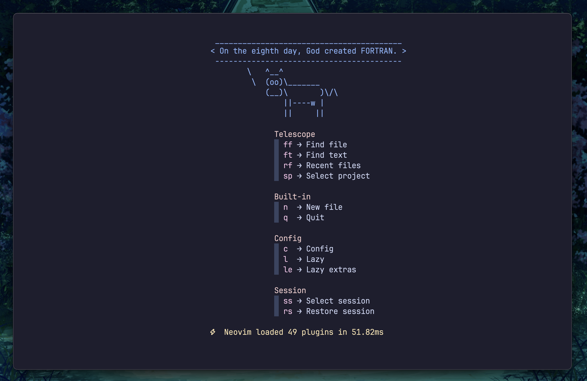
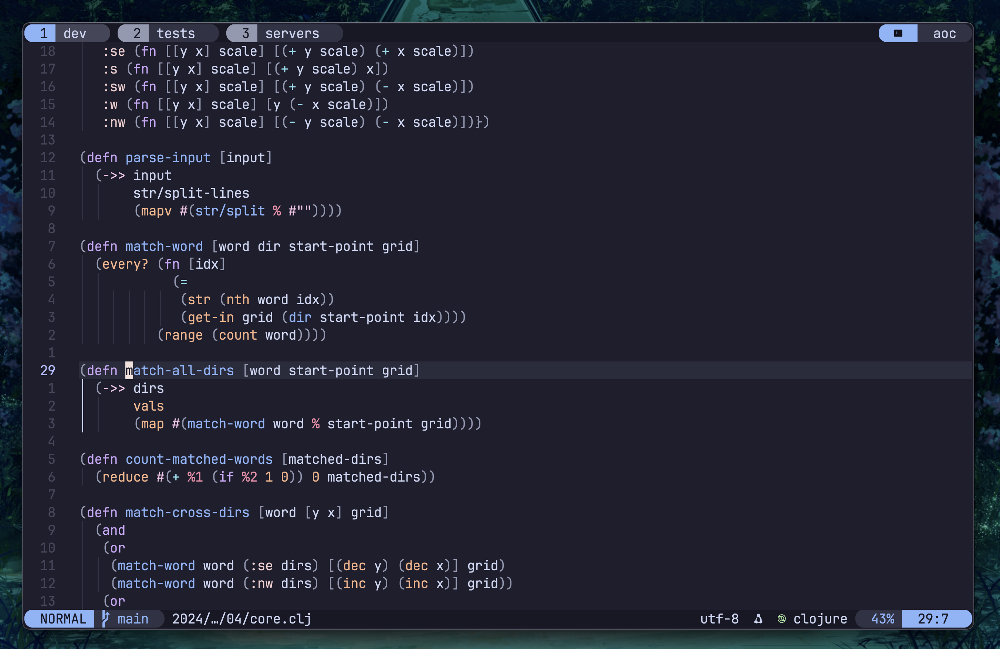
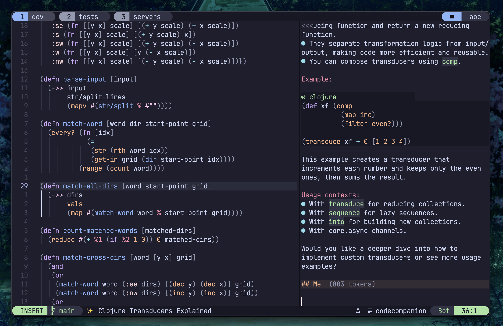
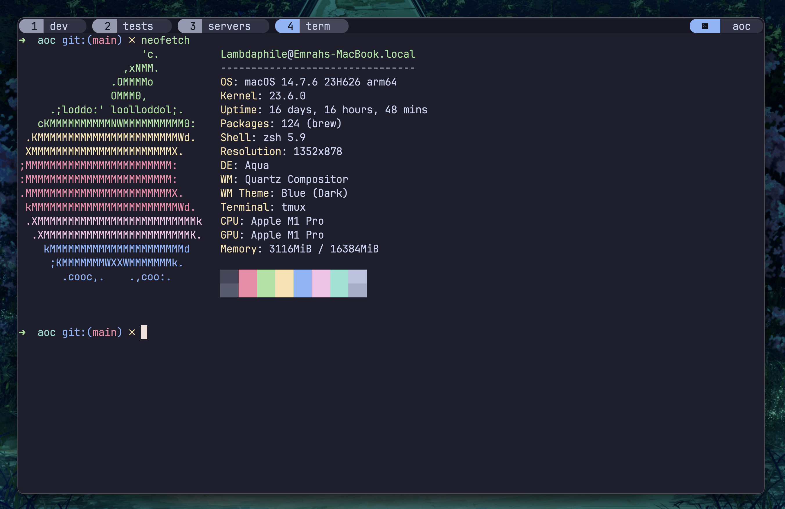

# ☕️ Dotfiles

My dotfiles for Neovim, Tmux, Alacritty, Zsh and more.

**🚀 Notable features**

- Sensible additions over the default [LazyVim](https://www.lazyvim.org/) config:
  - Minimalistic, [Cowsay](https://github.com/piuccio/cowsay) themed dashboard with added functionality for managing projects and sessions
  - Global git hunk highlighting
  - VSCode-like picker config, additional shortcuts like **Save All Files**, and more
- [Codecompanion](https://github.com/olimorris/codecompanion.nvim) integration:
  - Which-key support for chat actions
  - Spinner extension for chat requests
  - Persistent chat history
- Tmux:
  - Better Catppuccin Neovim & Tmux theme integration with matched colors and status bar styling

**⚠️ NOTE**: I’ll probably switch to Antidote in Zsh and use TPM with Tmux, along with some additional plugins. The configs of these will change a bit in the near future.

## Preview

Dashboard:

Neovim & Tmux:

Codecompanion:

Alacritty:

